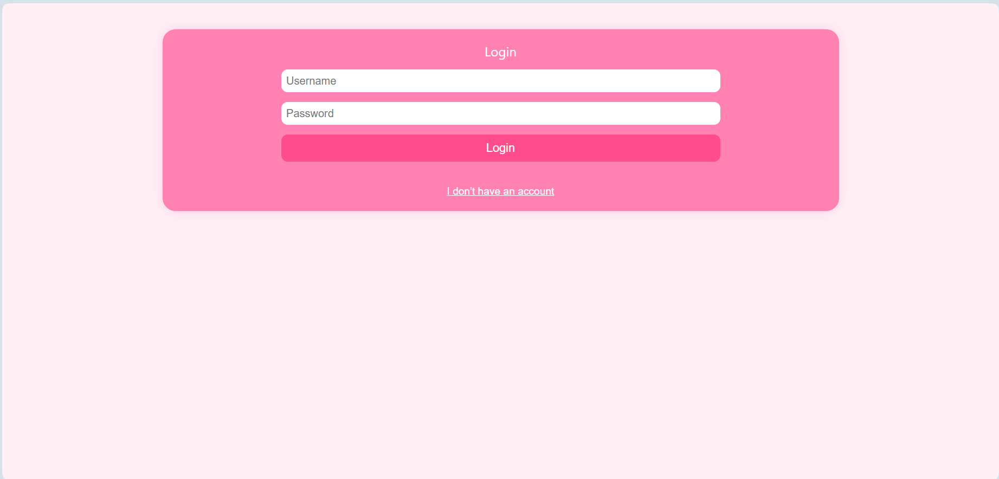
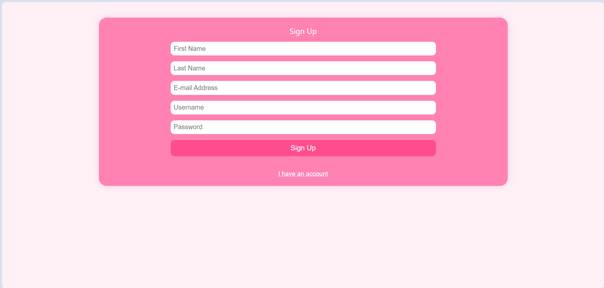
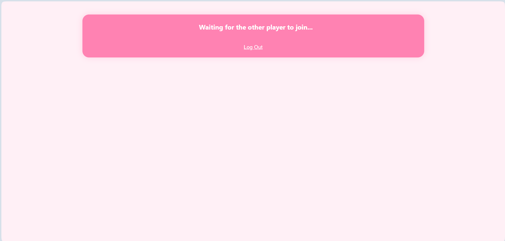
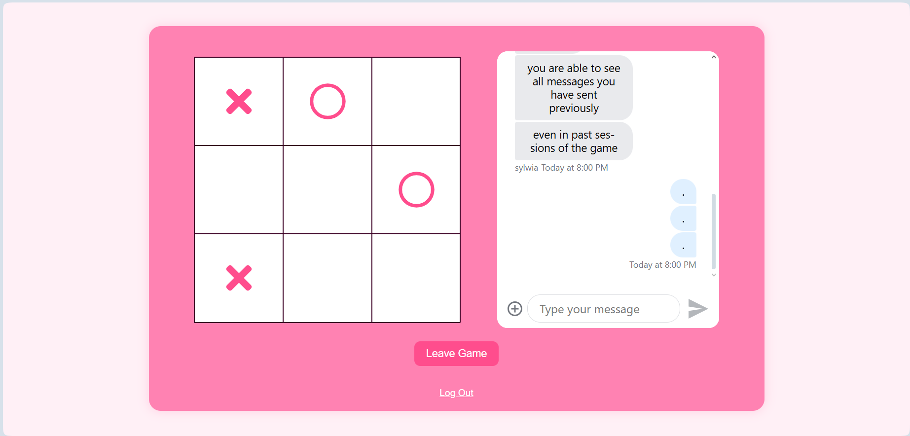

# Real-Time Multiplayer Tic-Tac-Toe
A small mulitplayer real-time tic-tac-toe game built with **React** and **Stream Chat**.  
It allows two players to play live against eachother while chatting in the same interface.  

### Authentication Screens
 

### Waiting Screen

### Game Board

---

# Tech Stack
- **React(Vite)** - main framework for the front-end
- **Stream Chat API** - handles real-time messaging between players
- **Axios & Cookies** - for authentication and API communication
- **CSS** - for custom styling (pink theme and layout)

---

# Lessons Learned
This project helped me practice and understand several core web development concepts:

- Integrating **third-party APIs** (Stream Chat) into a React app  
- Managing **authentication** with cookies and tokens  
- Using **React hooks** (`useState`, `useEffect`) to control game and chat state  
- Building **real-time interactivity** — updating the board and chat when players join  
- Structuring and styling components with custom CSS  
- Debugging state and reactivity issues

---

# Issues to Be Fixed in the Future
- The app doesn’t currently allow rejoining a game after refreshing the page while already on the board screen.

---

# About the Game
This project was inspired by a YouTube tutorial, which I used as a **base reference**.  
However, I didn’t follow it exactly - I adapted the code and structure to work with **JSX** instead of plain JS, which required adjustments because some of the tutorial’s approaches were outdated or no longer compatible with newer library versions.  

I also customized the visual design and styling to match my own preferences (pink theme and general layout).  
The main goal of the project was to **learn how real-time web applications work**, combining **React**, **state management**, and **API communication**.

---

# Author
Sylwia Rybak  
*Computer Science and Information Systems (semester 5)*  
GitHub: rybaks72 (https://github.com/rybaks72)

